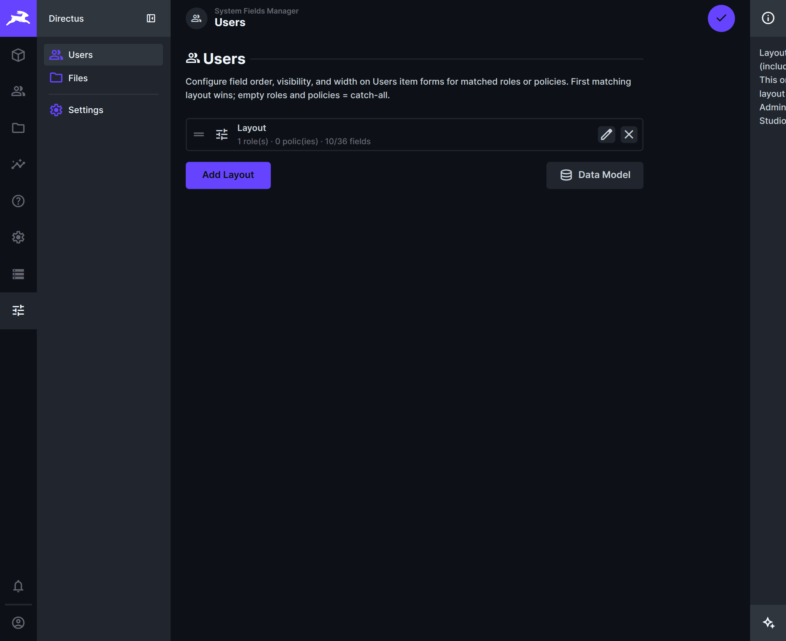
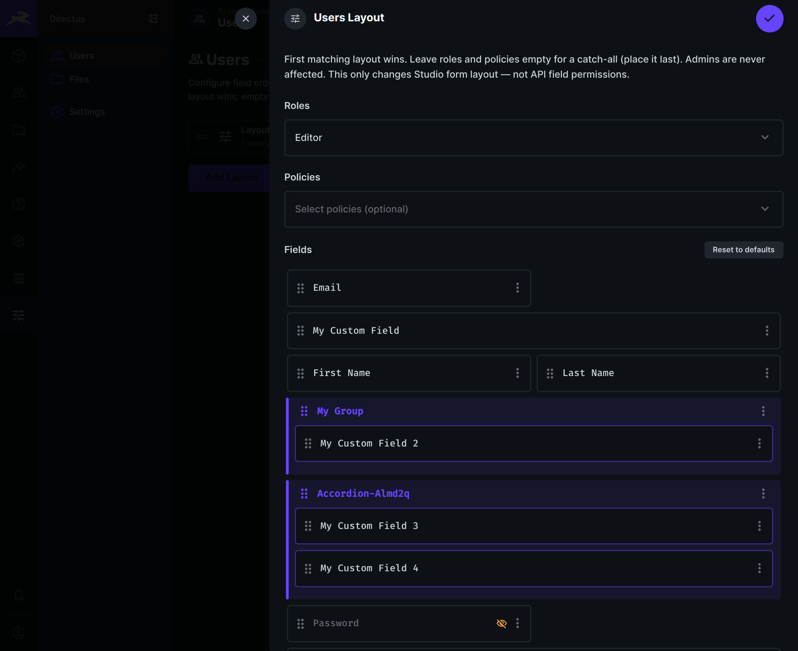
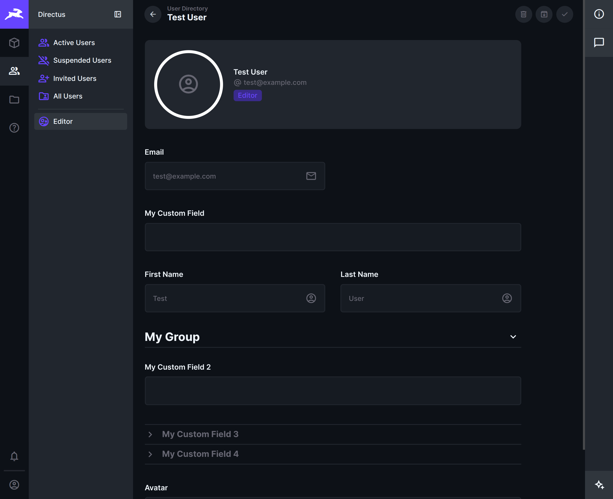
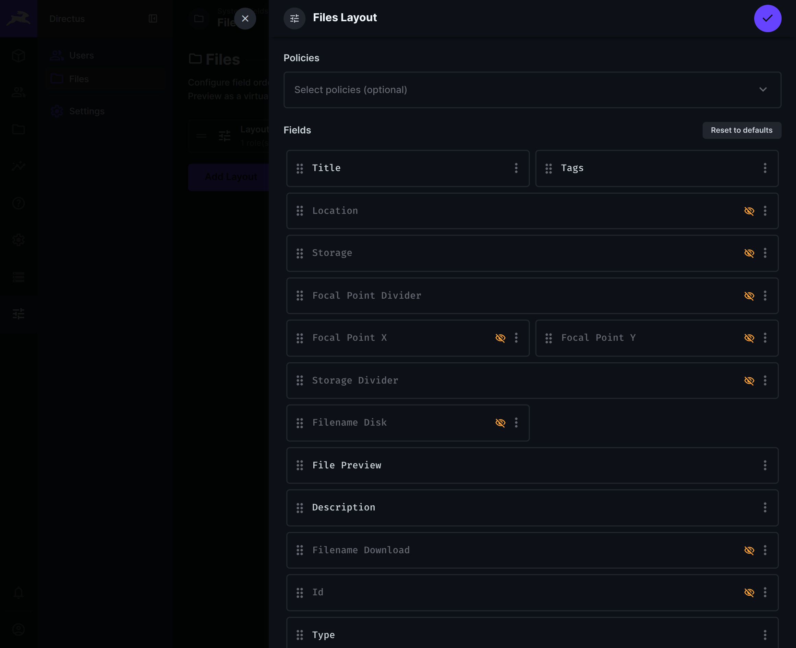
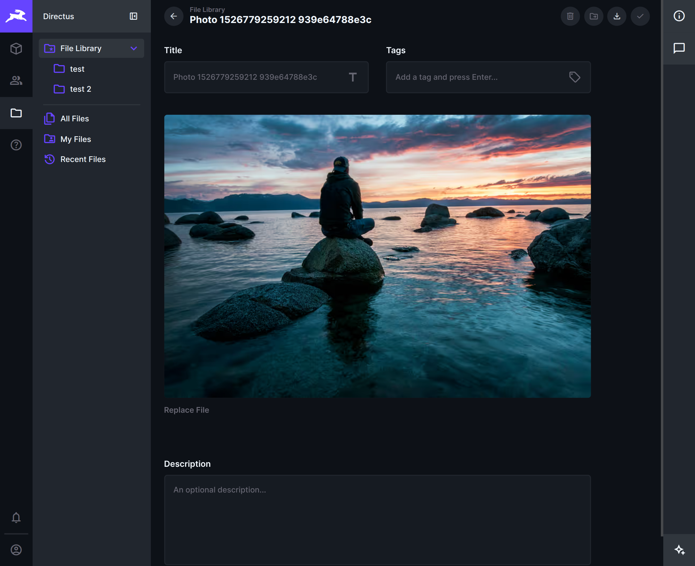

# System Fields Manager

Make the **Files** and **Users** screens in Directus simpler for your team — choose which fields they see, in which order, and how wide each one is.

Open **System Fields Manager** from the left bar (**admins only**). These layouts only apply to **non-admin** people. **Administrators always see the normal Directus forms.**

> **Important:** This cleans up what people see while editing. It does **not** replace Directus permissions. Someone might still reach a field through the API if their access allows it. Use Access Control for real security; use this extension to keep day-to-day screens calm and clear.

## Overview



Files and Users come with many built-in fields (storage details, theme options, tokens, and more). For Editors and similar roles that only need a few of them, that can feel noisy.

With **System Fields Manager** you create **layouts**:

1. Choose which **roles** (and policies, if you use them) the layout is for  
2. Drag fields into the order that fits your workflow  
3. Show or hide each field, and set how wide it appears  

Matched people then see a quieter form. Everyone else — and all admins — keep the usual Directus layout.

## Features

### Users

Simplify the user profile / user edit form for selected roles.





- Decide which fields appear (name, email, custom fields, and more)  
- Put important fields first; tuck the rest away or hide them  
- Place fields side by side (half width) or across the full row  
- Keep groups and expandable sections when you use them in the data model  
- Assign the layout to the right roles (or policies)

### Files

Same idea for the file detail screen — including where the preview sits.





- Reorder the fields on a file  
- Show only what your team needs (for example title, tags, and description)  
- Hide technical details they don’t use every day  
- Include **File Preview** as its own row — show or hide it and place it in the stack  
- Assign by role or policy, just like Users

### Settings

- **Export / import** your setup as a file (handy for backup or another project)  
- **Remove extension data** cleanly before uninstall (only this extension’s settings — not your files or users)

## How layouts work

For each layout:

1. Pick the **roles** and/or **policies** it should apply to  
2. Arrange the fields (drag to reorder)  
3. Turn visibility and width on or off per field  

**The first matching layout in the list wins.** Leave roles and policies empty for a **catch-all** that applies to everyone who didn’t match an earlier layout — put that one last.

## Getting started

1. Open **System Fields Manager** as an admin.  
2. Start with **Users** or **Files** — hide what your Editors don’t need.  
3. Assign each layout to the right roles (add a catch-all last if you want a default for everyone else).  
4. Save, then check the result with a **non-admin** account (or another browser profile).  
5. Optionally **Export** from Settings so you can restore the setup later.

## Tips

- Pair cleaner screens with the right **permissions** in Directus Access Control.  
- Admins won’t see layout changes on themselves — that’s expected; always test as a non-admin.  
- Export your setup before big changes or before uninstalling.  
- Uninstall cleanup only removes this extension’s data — your files, users, and other project settings stay intact.

## Installation

Requires **Directus 9.26+ through 12.x**.

### npm

```bash
npm install directus-extension-system-fields-manager
```

Place the package in your Directus `extensions` folder (or install into a project that loads extensions from `node_modules`), then restart Directus.

### Marketplace

Search for **System Fields Manager** in **Settings → Marketplace**. This bundle includes a server part, so some environments only allow App extensions from the Marketplace — use the npm or manual install below if install is blocked.

### Manual installation

1. Install and build:

```bash
cd directus-extension-system-fields-manager
npm install
npm run build
```

2. Copy the built package into your Directus `extensions` folder (include `package.json` and the `dist` folder).

3. Restart Directus.

4. In the Data Studio:

   1. Open **Settings → Project Settings → Modules**  
   2. Enable **System Fields Manager**  
   3. Open **System Fields Manager** from the left bar  

App users who should receive layouts need normal App Access (including read access to Project Settings) so the Studio can load their layout.

## License

MIT
